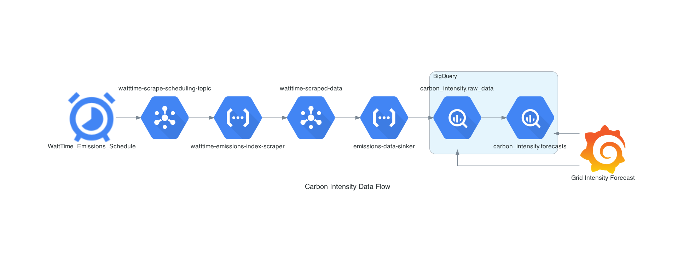
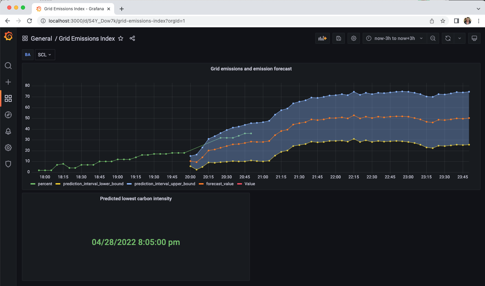

# Grid Carbon Intensity Tracker
Project tracks the carbon intensity for configurable grids, and uses historic carbon intensity values to forecast future carbon intensity values.

Using carbon intensity forecasts individuals or organizations can tailor how they use energy throughout the day, optimizing for periods where carbon emissions associated with using electricity are the lowest. As an example, an individual could use the forecasted carbon intensity values, and use certain appliances (washer, dryer, dishwasher, battery charging, etc.) when the carbon intensity is the lowest.

## Source Data
The source data for this project is collected from [WattTime](watttime.org), a "a nonprofit that offers technology solutions that make it easy for anyone to achieve emissions reductions without compromising cost, comfort, and function."

This project specifically uses the [Real-time Emissions Index API](https://www.watttime.org/api-documentation/#real-time-emissions-index), which provides real-time data on carbon intensity for a given grid, updated every 5 minutes.

## Architecture
Architecture of components in Google Cloud:

## Dashboard screenshot
Screenshot of Grafana dashboard, showing:
* Historic carbon intensity values
* Forecasted carbon intensity values, including an upper bound and lower bound for the forecasted values
* Prediction of when carbon intensity will be the lowest in the given time-range
